---

### 👨‍💻 About Me

- 🔭 Founder of Devrex Digital
- 🌱 Deepening my skills in Next.js, Supabase & full-stack development
- 💬 Ask me about React, Tailwind CSS, or frontend architecture
- 📫 Reach me via my [portfolio](https://hamzatariq.site)
- 📍 Based in Bahawalpur, Pakistan 🇵🇰

---

### 🛠️ Tech Stack

---

### 📊 GitHub Stats

---

### 📈 Detailed Metrics

---

⭐️ From [Hamza Tariq](https://github.com/HamzaTariq-Devrex)

